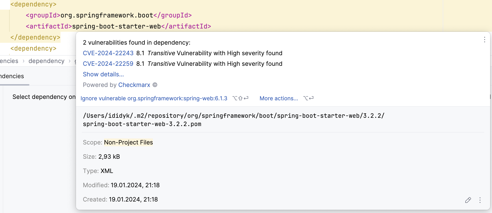

# CoffeeJug Demo: Security in Design


This repository contains a demo of java application and terraform code.

## Table of Contents

- [Tools overview](#application)
  - [Hadolint](#hadolint)
  - [SonarQube](#sonarqube)
  - [Checkmarks](#checkmarks)
  - [Trivy](#trivy)
  - [Snyk](#snyk)
  - [Trufflehog](#trufflehog)
  - [Gitleaks](#gitleaks)
  - [Git-secrets](#git-secrets)


## Tools overview

### Hadolint

* Scan `v0`
```shell
hadolint app/Dockerfile.v0
```

### Full `yaml` schema
```yaml
failure-threshold: string               # name of threshold level (error | warning | info | style | ignore | none)
format: string                          # Output format (tty | json | checkstyle | codeclimate | gitlab_codeclimate | gnu | codacy)
ignored: [string]                       # list of rules
label-schema:                           # See Linting Labels below for specific label-schema details
  author: string                        # Your name
  contact: string                       # email address
  created: timestamp                    # rfc3339 datetime
  version: string                       # semver
  documentation: string                 # url
  git-revision: string                  # hash
  license: string                       # spdx
no-color: boolean                       # true | false
no-fail: boolean                        # true | false
override:
  error: [string]                       # list of rules
  warning: [string]                     # list of rules
  info: [string]                        # list of rules
  style: [string]                       # list of rules
strict-labels: boolean                  # true | false
disable-ignore-pragma: boolean          # true | false
trustedRegistries: string | [string]    # registry or list of registries
```

* Scan `v0` with custom config
```shell
hadolint --config app/hadolint-config.yaml  app/Dockerfile.v0 | jq
```

* Build `v0`
```shell
mvn clean package && \
docker buildx build . -t coffee-jug-demo:v0 -f app/Dockerfile.v0 
```

* Scan `v0-fixed` with custom config
```shell
hadolint --config app/hadolint-config.yaml app/Dockerfile.v0-fixed | jq
```
```shell
hadolint --config app/hadolint-config.yaml app/Dockerfile.v0 | tidy -xml -iq
```

* Build `v0-fixed` docker container
```shell
docker buildx build . -t coffee-jug-demo:v0-fixed -f app/Dockerfile.v0-fixed
```

* Scan `v1` via hadolint
```shell
hadolint app/Dockerfile.v1
```

* Build `v1` docker container
```shell
docker buildx build . -t coffee-jug-demo:v1-fixed -f app/Dockerfile.v1-fixed
```

### SonarQube
=======

1. Start `sonarqube` via docker-compose
```shell
docker-compose -f app/sonarqube.yml up -d
```

2. Execute SonarScanner via maven
```shell
  mvn -f app/pom.xml clean verify sonar:sonar \
  -Dsonar.projectKey=CoffeeJugDemo \
  -Dsonar.projectName='CoffeeJugDemo' \
  -Dsonar.host.url=http://0.0.0.0:9000 \
  -Dsonar.token=sqp_04b3cdb170e93f2d376e9e9549de51fc20a32ae1
```

### Checkmarks

1. Go to `app` project to review `pom.xml`
   

2. Checkout `checkmarks: update dependency versions to resolve vulnerabilities` commit


### Trivy
1. Overview of doc https://aquasecurity.github.io/trivy/v0.51/docs
2. Image scan
```shell
trivy image openjdk:21-jdk
```

2. App full scan in `fs` mode scan
```shell
trivy fs --scanners vuln,secret,misconfig app/
```

3. Terraform full scan in `fs` mode scan
```shell
trivy fs --scanners vuln,secret,misconfig terraform/
```

4. Actions
* https://github.com/aquasecurity/trivy-action
* https://github.com/lazy-actions/gitrivy
* CodeQL tool -> https://github.com/ih0r-d/coffeeJugSecurityDemo/settings/security_analysis


### Snyk
```shell
snyk --help
```
* https://security.snyk.io/vuln

[](https://www.youtube.com/watch?v=BQWesBxbqWQ)

### Trufflehog

[//]: # (todo: need to add something)

### Gitleaks

[//]: # (todo: need to add something)

### Git-secrets

[//]: # (todo: need to add something)
